# ASHA AI - Intelligent Healthcare Memory System

> **Voice-first healthcare platform for rural Indian women**  
> Powered by Qdrant Vector Database | Built with Streamlit & Google Gemini

---

## 📖 Table of Contents

- [What is ASHA AI?](#-what-is-asha-ai)
- [Key Features](#-key-features)
- [Use Cases](#-use-cases)
- [The Critical Role of Qdrant](#-the-critical-role-of-qdrant)
- [System Architecture](#️-system-architecture)
- [Quick Start](#-quick-start)
- [Configuration](#-configuration)
- [Project Structure](#-project-structure)
- [Usage Examples](#-usage-examples)
- [Development Guide](#-development-guide)
- [Troubleshooting](#-troubleshooting)
- [Tech Stack](#-tech-stack)
- [License](#-license)

---

## 🎯 What is ASHA AI?

ASHA AI is a **long-term health memory system** (not a traditional chatbot) designed specifically for rural Indian women and ASHA (Accredited Social Health Activist) healthcare workers. It addresses critical healthcare challenges in rural India where:

- 📱 **Limited literacy**: Voice-first interface eliminates typing barriers
- 🏥 **Healthcare access gaps**: Women often miss early warning signs
- 📊 **Lack of health tracking**: No systematic way to track health patterns over time
- 👶 **Maternal health risks**: High maternal mortality rates in rural areas

### Core Principles

1. **NO response without retrieval**: Every answer is grounded in Qdrant vector database retrieval
2. **Memory accumulation**: Health signals are stored and analyzed over time to detect patterns
3. **Privacy-first**: Anonymous user identification, no PII storage
4. **Evidence-based**: All medical guidance comes from WHO protocols and verified sources
5. **Culturally adapted**: Multilingual support with Hindi as the primary language

---

## ✨ Key Features

### For Rural Women (Primary Users)

| Feature | Description | Impact |
|---------|-------------|--------|
| 🎤 **Voice-First Interface** | No typing required - speak in Hindi or English | Eliminates literacy barriers |
| 🧠 **Long-Term Memory** | System remembers health signals across weeks/months | Detects deteriorating patterns |
| 🎯 **Contextual Risk Assessment** | Real-time risk scoring based on symptoms + history | Early warning for complications |
| 🔒 **Complete Privacy** | SHA-256 hashed IDs, no personal identifiable data stored | Safe for shared phones |
| 🗣️ **Voice Responses** | Text-to-speech output in native language | Accessible to non-readers |
| 📱 **Mobile-Optimized** | Streamlit responsive design works on any phone | Works on basic smartphones |

### For ASHA Workers (Healthcare Providers)

| Feature | Description | Impact |
|---------|-------------|--------|
| 📊 **Population Dashboard** | See all high-risk women in the village | Prioritize home visits |
| 🚨 **Silent Deterioration Alerts** | Automatic detection of health decline patterns | Catch worsening cases early |
| 📈 **Health Trend Analytics** | Village-level insights on common symptoms | Community health planning |
| 💊 **Nutrition Compliance** | Track IFA (Iron-Folic Acid) tablet consumption | Reduce anemia rates |
| 🔍 **Evidence Trail** | Every recommendation is backed by retrieval evidence | Build trust and credibility |

---

## 💡 Use Cases

### Use Case 1: Early Detection of Severe Anemia

**Scenario**: Priya, a 26-year-old pregnant woman in her 2nd trimester

**Timeline**:

- **Week 1**: Reports feeling "थोड़ी कमजोरी" (a bit weak) → Risk: 0.3 (Low)
- **Week 3**: Reports "चक्कर आना" (dizziness) → Risk: 0.5 (Medium) - Memory reinforcement activated
- **Week 5**: Reports "सांस फूलना" (breathlessness) → Risk: 0.8 (High) - **Deterioration alert triggered!**

**ASHA Action**: Automated alert to ASHA worker dashboard → Home visit scheduled → Hemoglobin test arranged → IFA supplement dosage adjusted

**Outcome**: Severe anemia detected 2-3 weeks earlier than traditional methods

---

### Use Case 2: Pattern Recognition Across Population

**Scenario**: Village-level health insights for ASHA worker Meera

**Qdrant Analysis**:

- Query: "Show me high-risk pregnant women in the last 30 days"
- Retrieval: 12 women with risk scores > 0.7
- Common symptoms: Dizziness (8), Weakness (10), Swelling (5)
- Pattern: All in 3rd trimester, monsoon season

**ASHA Action**:

- Organize group nutrition camp
- Distribute mosquito nets (potential malaria link)
- Schedule blood pressure checks for women with swelling

**Outcome**: Preventive community-level intervention vs individual reactive care

---

### Use Case 3: Memory-Powered Continuity of Care

**Scenario**: Kavita visits different ASHA workers (shared-phone scenario)

**Traditional System**: Each consultation starts from scratch, no history

**ASHA AI with Qdrant**:

- Anonymous user ID (SHA-256 hash of phone + village)
- Retrieves past 90 days of health signals
- Shows risk trajectory: Improving ✅ / Stable ➡️ / Declining ⚠️
- LLM generates contextual advice: "You mentioned leg swelling 2 weeks ago. Is it better now?"

**Outcome**: Continuity of care even with provider changes

---

## 🗄️ The Critical Role of Qdrant

**Qdrant is not optional** - it is the brain of ASHA AI. Removing Qdrant would render the system completely non-functional.

### Why Qdrant?

| Requirement | Why Qdrant is Essential |
|-------------|--------------------------|
| **Semantic Search** | Find similar health patterns even if phrased differently ("chakkar aana" vs "dizziness") |
| **Multilingual Support** | BGE-M3 embeddings work across Hindi, English without translation |
| **Time-Series Memory** | Store and retrieve health signals chronologically with metadata |
| **Fast Retrieval** | Sub-100ms lookups crucial for real-time voice interactions |
| **Population Analytics** | Aggregate queries across users for ASHA dashboard |
| **Grounded AI** | RAG architecture ensures LLM responses are evidence-based |

### The Four Qdrant Collections


#### 1️⃣ `user_health_memory` Collection

**Purpose**: Stores individual health signals over time

**Schema**:

```python
{
    "user_id": "a3f2c1...",        # SHA-256 hash (anonymous)
    "signal_text": "I am feeling dizzy and weak",
    "signal_type": "symptom",       # symptom | nutrition | vitals
    "timestamp": "2026-01-21T10:30:00",
    "risk_score": 0.65,
    "user_context": {
        "age": 26,
        "pregnancy_stage": "2nd_trimester",
        "language": "hi"
    },
    "vector": [0.234, -0.123, ...]  # 768-dim BGE-M3 embedding
}
```

**Operations**:

- **Write**: Every user interaction stores a new memory
- **Read**: Retrieve user's past health signals for context
- **Aggregate**: Detect deterioration by comparing risk scores over time

---

#### 2️⃣ `verified_medical_knowledge` Collection

**Purpose**: WHO protocols, medical guidelines, symptom databases

**Schema**:

```python
{
    "knowledge_id": "who_anemia_001",
    "title": "Anemia in Pregnancy - WHO Guidelines",
    "content": "Hemoglobin <11 g/dL indicates anemia...",
    "source": "WHO Maternal Health Guidelines 2016",
    "language": "en",
    "tags": ["anemia", "pregnancy", "iron-deficiency"],
    "vector": [0.456, -0.789, ...]
}
```

**Seeding Command**:

```bash
python medical_knowledge_seed.py
```

**Example Seeds**:

- Pregnancy complications (WHO)
- Nutrition deficiency symptoms (ICMR)
- IFA supplementation guidelines
- Warning signs requiring immediate medical care

---

#### 3️⃣ `nutrition_patterns` Collection

**Purpose**: Local food nutrition data, dietary patterns

**Schema**:

```python
{
    "food_item": "Spinach (पालक)",
    "iron_content_mg": 2.7,
    "pregnancy_safe": true,
    "local_availability": "high",
    "preparation_tips": "Cook with tomatoes for better iron absorption",
    "vector": [...]
}
```

**Use Case**: When user asks "मुझे क्या खाना चाहिए?" (What should I eat?), retrieve iron-rich foods available locally

---

#### 4️⃣ `asha_population_insights` Collection

**Purpose**: Aggregated village-level health trends

**Schema**:

```python
{
    "village_id": "v123",
    "time_period": "2026-01-01_to_2026-01-31",
    "high_risk_count": 12,
    "common_symptoms": ["dizziness", "weakness"],
    "avg_risk_score": 0.58,
    "vector": [...]
}
```

**ASHA Dashboard Query**:

```python
qdrant_client.get_high_risk_users(threshold=0.7, limit=20)
```

---

### Memory Evolution Lifecycle

```mermaid
sequenceDiagram
    participant User
    participant System
    participant Qdrant
    participant LLM

    User->>System: "मुझे चक्कर आ रहे हैं" (I feel dizzy)
    System->>Qdrant: Embed query + Search user_health_memory
    Qdrant-->>System: Past 3 mentions of dizziness (reinforcement!)
    System->>Qdrant: Search verified_medical_knowledge
    Qdrant-->>System: Anemia guidelines, pregnancy warnings
    System->>LLM: Generate response with evidence
    LLM-->>System: "This is your 3rd episode. Risk is HIGH..."
    System->>Qdrant: Store new memory with risk=0.75
    System->>User: Voice response + ASHA alert
```



**Key Mechanisms**:

1. **Reinforcement**: Repeated symptoms increase risk scores

   ```python
   # In memory_manager.py
   if similar_memories > 2:
       risk_score *= MEMORY_REINFORCEMENT_BOOST  # 1.5x
   ```

2. **Decay**: Old low-risk signals fade over time

   ```python
   if days_old > 30 and risk_score < 0.3:
       weight *= MEMORY_DECAY_RATE  # 0.95
   ```

3. **Deterioration Detection**:

   ```python
   recent_avg_risk = avg(last_7_days_risk)
   older_avg_risk = avg(days_8_to_30_risk)
   if recent_avg_risk > older_avg_risk + 0.2:
       trigger_asha_alert()
   ```

---

## 🏗️ System Architecture

### High-Level Data Flow


### Retrieval-First Architecture

**Critical Point**: NO LLM response is generated without first retrieving from Qdrant.

**Code Enforcement** (main_pipeline.py:116-118):

```python
retrieval_results = self.retrieval.retrieve_for_query(...)
if not retrieval_results:
    raise RuntimeError("CRITICAL: Retrieval failed - cannot proceed")
```

**Retrieval Process**:

1. **Embed user query** using Google `embedding-001` model (768-dim)
2. **Multi-collection search**:

   ```python
   user_memories = qdrant.search('user_health_memory', vector, top_k=10)
   medical_knowledge = qdrant.search('verified_medical_knowledge', vector, top_k=5)
   nutrition_data = qdrant.search('nutrition_patterns', vector, top_k=3)
   ```

3. **Re-rank by**:
   - Recency (newer memories weighted higher)
   - Risk score (high-risk signals prioritized)
   - Confidence score from embedding similarity
4. **Pass top 5 results to LLM** as grounding evidence
5. **Generate response** constrained to retrieved evidence
6. **Store interaction** back to user_health_memory

---

## 🚀 Quick Start

### Prerequisites

1. **Docker** (for Qdrant)
2. **Python 3.9+**
3. **Google Gemini API Key** ([Get one here](https://ai.google.dev/))

### Step 1: Start Qdrant

```powershell
# Pull and run Qdrant container
docker run -p 6333:6333 -p 6334:6334 qdrant/qdrant

# Verify Qdrant is running
curl http://localhost:6333
```

**Expected Output**:

```json
{"title":"qdrant - vector search engine","version":"1.7.3"}
```

### Step 2: Clone and Install

```powershell
# Navigate to project directory
cd C:\Users\YourName\Desktop\Convolve

# Install dependencies
pip install -r requirements.txt
```

### Step 3: Configure Environment

```powershell
# Copy example environment file
Copy-Item .env.example .env

# Edit .env and add your Google API key
notepad .env
```

**Required in .env**:

```env
GOOGLE_API_KEY=your_api_key_here
QDRANT_HOST=localhost
QDRANT_PORT=6333
```

### Step 4: Seed Medical Knowledge

```powershell
# Populate Qdrant with WHO guidelines and medical knowledge
python medical_knowledge_seed.py
```

**Expected Output**:

```
✅ Created collection: verified_medical_knowledge
✅ Seeded 156 medical knowledge entries
✅ Created collection: nutrition_patterns
✅ Seeded 47 nutrition entries
```

### Step 5: Run Application

```powershell
streamlit run app.py
```

**App URL**: <http://localhost:8501>

---

## ⚙️ Configuration

### Environment Variables Reference

| Variable | Description | Default | Required |
|----------|-------------|---------|----------|
| `QDRANT_HOST` | Qdrant server hostname | `localhost` | ✅ |
| `QDRANT_PORT` | Qdrant server port | `6333` | ✅ |
| `QDRANT_API_KEY` | API key if using Qdrant Cloud | - | ❌ |
| `GOOGLE_API_KEY` | Google Gemini API key | - | ✅ |
| `EMBEDDING_MODEL` | Google embedding model | `models/embedding-001` | ✅ |
| `DEFAULT_LANGUAGE` | Default voice language | `hi` (Hindi) | ✅ |
| `SUPPORTED_LANGUAGES` | Comma-separated language codes | `hi,en` | ✅ |
| `RISK_THRESHOLD_HIGH` | High-risk score threshold | `0.7` | ✅ |
| `RISK_THRESHOLD_MEDIUM` | Medium-risk score threshold | `0.4` | ✅ |
| `SESSION_TIMEOUT_MINUTES` | Auto-wipe timeout for shared phones | `30` | ✅ |
| `AUTO_WIPE_ENABLED` | Enable auto-wipe after timeout | `true` | ✅ |

### Language Support

| Language | Code | Status | Voice Recognition |
|----------|------|--------|-------------------|
| Hindi | `hi` | ✅ Supported | Google Speech API |
| English (India) | `en` | ✅ Supported | Google Speech API |
| Tamil | `ta` | 🔜 Planned | Ready to add |
| Bengali | `bn` | 🔜 Planned | Ready to add |

**Adding a new language**:

1. Update `SUPPORTED_LANGUAGES` in `.env`
2. Add language code to `LANGUAGE_CODES` in `config.py`
3. Seed medical knowledge in that language (translate `medical_knowledge_seed.py`)

---

## 📁 Project Structure

```
Convolve/
├── app.py                      # Streamlit UI (User + ASHA dashboard)
├── main_pipeline.py            # Main orchestration pipeline
├── config.py                   # Configuration and environment variables
│
├── Core Components
│   ├── qdrant_manager.py       # Qdrant client and collection management
│   ├── embeddings.py           # Google embedding generation
│   ├── retrieval_engine.py     # Multi-collection retrieval logic
│   ├── llm_handler.py          # Google Gemini LLM integration
│   ├── memory_manager.py       # Memory storage and evolution logic
│   ├── risk_scorer.py          # Risk assessment algorithms
│   └── privacy.py              # PII sanitization and hashing
│
├── Voice Components
│   ├── voice_input.py          # Speech-to-text (Google Speech API)
│   └── voice_output.py         # Text-to-speech (gTTS)
│
├── Utilities
│   ├── logger.py               # Structured logging with Loguru
│   └── medical_knowledge_seed.py  # Qdrant knowledge seeding script
│
├── Configuration Files
│   ├── requirements.txt        # Python dependencies
│   ├── .env.example            # Environment variable template
│   ├── .env                    # Your local config (DO NOT COMMIT)
│   └── .gitignore              # Git ignore rules
│
├── Runtime Directories
│   ├── logs/                   # Application logs (auto-created)
│   ├── temp_audio/             # Temporary voice recordings (auto-cleaned)
│   └── __pycache__/            # Python bytecode cache
│
└── setup.ps1                   # Windows setup automation script
```

---

## 🎭 Usage Examples

### Example 1: Symptom Reporting (Hindi Voice Input)

**User speaks**: "मुझे कल से पेट में दर्द हो रहा है और उल्टी भी आ रही है"  
*(I have been having stomach pain since yesterday and also vomiting)*

**System Processing**:

1. Speech-to-Text → "मुझे कल से पेट में दर्द हो रहा है और उल्टी भी आ रही है"
2. Embedding → 768-dim vector
3. Qdrant Retrieval:
   - User memories: 1 previous stomach pain report (3 weeks ago)
   - Medical knowledge: Food poisoning, pregnancy complications
4. Risk Assessment: 0.68 (Medium-High) - Pregnancy context increases risk
5. LLM Response Generation:

   ```
   मुझे बताने के लिए धन्यवाद। गर्भावस्था में पेट दर्द और उल्टी सामान्य हो सकती है,
   लेकिन आपने पहले भी पेट दर्द बताया था। कृपया ASHA दीदी से मिलें या स्वास्थ्य केंद्र जाएं।
   पानी पीते रहें और आराम करें।
   
   (Thank you for telling me. Stomach pain and vomiting can be normal in pregnancy,
   but you also mentioned stomach pain before. Please meet ASHA didi or visit health center.
   Keep drinking water and rest.)
   ```

6. Memory Update: New entry in `user_health_memory` with risk=0.68
7. ASHA Alert: Added to medium-priority list on dashboard

**Voice Output**: gTTS plays response in Hindi

---

### Example 2: Nutrition Query (Text Input)

**User types**: "What should I eat to increase my hemoglobin?"

**System Processing**:

1. Text Input → Embedding
2. Qdrant Retrieval:
   - Medical knowledge: Anemia prevention, iron absorption
   - Nutrition patterns: Spinach, lentils, jaggery
   - User memories: No previous anemia reports
3. Risk Assessment: 0.3 (Low) - Preventive query, not symptom
4. LLM Response:

   ```
   Great question! To increase hemoglobin:
   
   🥬 Iron-rich foods: Spinach (palak), amaranth leaves (chaulai), lentils (dal)
   🍅 Vitamin C helps: Eat these with tomatoes or lemon juice
   💊 IFA tablets: Take your prescribed iron-folic acid supplements daily
   ☕ Avoid: Tea/coffee right after meals (blocks iron absorption)
   
   Sources: WHO Nutrition Guidelines, ICMR Dietary Recommendations
   ```

5. Memory Update: Logged as "nutrition_query"

**No ASHA Alert**: Low risk, preventive care

---

### Example 3: ASHA Dashboard Query

**ASHA worker**: Opens "ASHA Dashboard" tab

**System Processing**:

1. Query: `qdrant_client.get_high_risk_users(threshold=0.7)`
2. Qdrant Search: Filter `user_health_memory` by risk_score >= 0.7
3. Results:

   ```
   | User ID   | Age | Pregnancy | Risk | Last Signal        | Date       |
   |-----------|-----|-----------|------|-------------------|------------|
   | a3f2c1... | 24  | 3rd tri   | 0.82 | Severe headache   | 2026-01-20 |
   | b7e9a2... | 27  | 2nd tri   | 0.75 | Swollen feet      | 2026-01-19 |
   | c4d1f3... | 22  | Postpartum| 0.73 | Heavy bleeding    | 2026-01-21 |
   ```

4. Display: Sorted by risk score (highest first)
5. Recommendations:
   - 🚨 User a3f2c1... - **Urgent follow-up needed** (Risk: 0.82, severe headache)
   - ⚠️ User b7e9a2... - Schedule visit soon (Risk: 0.75, swollen feet)

---

## 🛠️ Development Guide

### Code Structure Guidelines

**Module Responsibilities**:

| Module | Responsibility | Key Functions |
|--------|----------------|---------------|
| `qdrant_manager.py` | Qdrant CRUD operations | `create_collection()`, `store_health_signal()`, `search_similar()` |
| `retrieval_engine.py` | Multi-collection retrieval logic | `retrieve_for_query()`, `rerank_results()` |
| `memory_manager.py` | Memory evolution and deterioration | `store_health_signal()`, `detect_deterioration()` |
| `risk_scorer.py` | Risk calculation algorithms | `calculate_risk_score()`, `get_risk_category()` |
| `llm_handler.py` | LLM prompt engineering and safety | `generate_response()`, `apply_safety_filters()` |

**Design Patterns**:

- **Singleton pattern**: All managers are instantiated once (e.g., `qdrant_client`)
- **Pipeline pattern**: `main_pipeline.py` orchestrates sequential steps
- **Dependency injection**: Components receive dependencies at import time

---

### Testing Guidelines

#### 1. Unit Testing (Manual for now)

**Test Qdrant Connection**:

```python
from qdrant_manager import qdrant_client
assert qdrant_client.health_check() == True
```

**Test Embedding Generation**:

```python
from embeddings import embedding_encoder
vector = embedding_encoder.encode("test query")
assert len(vector) == 768
```

#### 2. Integration Testing

**Full Pipeline Test**:

```powershell
# Start Qdrant
docker run -p 6333:6333 qdrant/qdrant

# Seed knowledge
python medical_knowledge_seed.py

# Test text query
python -c "from main_pipeline import pipeline; print(pipeline.process_text_query('I feel dizzy', {'age': 25}, 'en'))"
```

**Expected**: Should return response with risk score, not error

#### 3. System Testing

**Critical Test: Qdrant Dependency**

```powershell
# Stop Qdrant container
docker stop <container_id>

# Try to run app
streamlit run app.py
```

**Expected**: App shows error "Qdrant database not available" - proves system cannot function without Qdrant

---

### Adding New Features

#### Example: Add New Qdrant Collection for "Lab Results"

1. **Define collection in config.py**:

   ```python
   COLLECTION_LAB_RESULTS = "lab_results"
   ```

2. **Create collection in qdrant_manager.py**:

   ```python
   def create_lab_results_collection(self):
       self.client.create_collection(
           collection_name=COLLECTION_LAB_RESULTS,
           vectors_config=VectorParams(size=768, distance=Distance.COSINE)
       )
   ```

3. **Update retrieval_engine.py**:

   ```python
   lab_results = self.qdrant.search(COLLECTION_LAB_RESULTS, query_vector, limit=3)
   ```

4. **Add seeding in medical_knowledge_seed.py**

---

## 🚨 Troubleshooting

### Issue 1: Qdrant Connection Failed

**Error Message**:

```
Error: Failed to connect to Qdrant at localhost:6333
```

**Solutions**:

1. **Check if Qdrant is running**:

   ```powershell
   docker ps
   ```

   If not listed, start it:

   ```powershell
   docker run -p 6333:6333 qdrant/qdrant
   ```

2. **Check port conflicts**:

   ```powershell
   netstat -ano | findstr :6333
   ```

   If another process is using port 6333, either kill it or change Qdrant port in `.env`

3. **Firewall blocking**:

   ```powershell
   # Allow port 6333 in Windows Firewall
   New-NetFirewallRule -DisplayName "Qdrant" -Direction Inbound -LocalPort 6333 -Protocol TCP -Action Allow
   ```

---

### Issue 2: Speech Recognition Not Working

**Error Message**:

```
Error: Speech not understood
```

**Solutions**:

1. **Check internet connection**: Google Speech API requires internet
2. **Try clearer audio**: Speak slowly and clearly
3. **Check microphone permissions**: Browser needs microphone access
4. **Fallback to text**: Use "Type Text" tab instead

---

### Issue 3: Missing Google API Key

**Error Message**:

```
ValueError: Configuration errors: GOOGLE_API_KEY not set in environment
```

**Solution**:

```powershell
# Edit .env file
notepad .env

# Add this line:
GOOGLE_API_KEY=your_actual_api_key_here

# Restart the app
streamlit run app.py
```

---

### Issue 4: Out of Memory / Slow Performance

**Symptoms**: App crashes or is very slow

**Solutions**:

1. **Reduce retrieval top_k** in `config.py`:

   ```python
   RETRIEVAL_TOP_K = 5  # Reduce from 10
   ```

2. **Clean old memories**:

   ```python
   # In qdrant_manager.py, add cleanup function
   def clean_old_memories(days=365):
       # Delete memories older than 365 days
   ```

3. **Use Qdrant Cloud** instead of local Docker (better scaling)

---

### Issue 5: Non-English Characters Not Displaying

**Symptom**: Hindi text shows as ����

**Solution**:

```python
# In streamlit config.toml (create if not exists)
# .streamlit/config.toml

[server]
enableCORS = false
enableXsrfProtection = false

[runner]
magicEnabled = true

# Set UTF-8 encoding
```

---

## 🔧 Tech Stack

| Layer | Technology | Version | Purpose |
|-------|-----------|---------|---------|
| **Frontend** | Streamlit | 1.31.0 | Web UI framework |
| | audio-recorder-streamlit | 0.0.8 | Browser voice recording |
| **Vector Database** | Qdrant | 1.7.3+ | Core memory and retrieval engine |
| **Embeddings** | Google Embedding API | embedding-001 | 768-dim multilingual vectors |
| **LLM** | Google Gemini | 2.5-flash | Response generation |
| **Voice** | Google Speech API | - | Speech-to-text |
| | gTTS | 2.5.0 | Text-to-speech |
| **Privacy** | SHA-256 hashing | - | Anonymous user IDs |
| **Logging** | Loguru | 0.7.2 | Structured logging |
| **Language** | Python | 3.9+ | Backend logic |

---

## 📊 Success Metrics

### System Validation Checklist

✅ **Qdrant is mandatory**: Removing Qdrant breaks the entire system  
✅ **Memory evolves**: Risk scores increase with repeated symptoms (reinforcement)  
✅ **Evidence-based**: All responses cite sources from Qdrant retrieval  
✅ **Privacy-compliant**: No PII stored, SHA-256 hashed user IDs  
✅ **Voice-first functional**: Works entirely via speech (no typing required)  
✅ **ASHA dashboard operational**: Population insights powered by Qdrant aggregation  
✅ **Multilingual**: Hindi and English fully supported  
✅ **Deterioration detection**: Silent health decline triggers alerts  

---

## 📝 License

This project is built for **healthcare research and social good**.

**Purpose**:

- Reduce maternal mortality in rural India
- Bridge healthcare access gaps
- Empower ASHA workers with data-driven insights

**Restrictions**:

- Not for commercial use without permission
- Not a substitute for professional medical care
- Must comply with Indian health data regulations

---

## 🙏 Acknowledgments

- **WHO (World Health Organization)**: Maternal health protocols and guidelines
- **ICMR (Indian Council of Medical Research)**: Nutrition guidelines for pregnant women
- **ASHA Worker Program**: Inspiration and real-world use cases
- **Qdrant**: Vector database technology enabling semantic health memory
- **Google AI**: Gemini LLM and embedding models for multilingual support

---

## 📞 Support

**For Issues**: Create a GitHub issue with:

- Error message
- Steps to reproduce
- System info (Python version, OS)

**For Feature Requests**: Describe:

- Use case / user story
- Expected behavior
- Priority (High/Medium/Low)

---

**Built with ❤️ for rural healthcare workers and mothers**

*Because every woman deserves to have her health story remembered and understood.*
